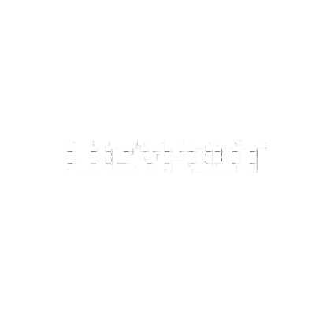
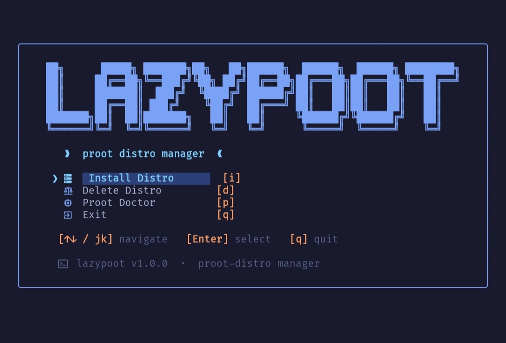
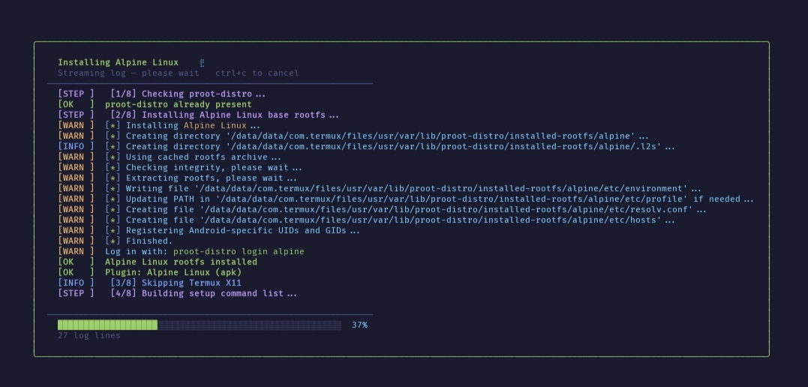

<div align="center">



# LazyPoot

**A modern TUI toolkit for installing and managing Linux distributions in Termux via proot-distro.**

[](LICENSE)
[](https://go.dev)
[](https://termux.dev)
[](https://termux.dev)
[]()

</div>

---


## Table of Contents

- [Overview](#-overview)
- [Screenshots](#-screenshots)
- [Quick Install](#-quick-install)
- [Architecture](#-architecture)
  - [Model View Update](#model-view-update-bubble-tea)
  - [Navigation](#navigation)
  - [Async Operations](#async-operations)
- [Key Conventions](#-key-conventions)
  - [Naming](#naming)
  - [Error Handling](#error-handling)
  - [Plugin Architecture](#plugin-architecture)
  - [Portal Script](#portal-script)
- [Build System](#-build-system)
- [Install Pipeline](#-install-pipeline)
- [Doctor Mode](#-doctor-mode)
- [Font Installation](#-font-installation)
- [Important Files](#-important-files)
- [Dependencies](#-dependencies)
- [Contributing](#-contributing)

---

## ✦ Overview

LazyPoot is a Go-based TUI application for Termux that installs and manages Linux distributions through `proot-distro`. It follows the Elm Architecture pattern (Model-View-Update) using [Bubble Tea](https://github.com/charmbracelet/bubbletea) and is styled with a **Tokyo Night** color theme via [Lip Gloss](https://github.com/charmbracelet/lipgloss).

**Supported features:**

| Feature | Description |
|---|---|
| 📦 Distro Installation | Interactive selection and install of 17+ Linux distros |
| 🖥️ Desktop Environments | Automated DE setup (XFCE, LXDE, etc.) |
| 🎮 Display & Driver Config | X11, Termux:X11, VirGL GPU support |
| 👤 User Management | Add, delete, hostname, password setup |
| 🐚 Shell Hook Injection | RC file integration for seamless login |
| 🚪 Portal Login | Per-distro portal scripts with user selection |
| 🩺 Doctor Mode | Environment health checks, diagnostics |
| 🔤 Font Installer | Auto-downloads FiraCode Nerd Font v3.4.0 |

---

## 📸 Screenshots

<div align="center">


| Main Menu | Install Flow |
|:---------:|:------------:|
|  |  |

</div>

---

## 🚀 Quick Install

```bash
# Download the binary
wget https://github.com/Lamprozx/Lazypoot/releases/download/v1.0.0-beta/lazypoot-arm64
chmod +x lazypoot-arm64
./lazypoot-arm64
```

Or build from source:

```bash
git clone https://github.com/Lamprozx/Lazypoot.git
cd Lazypoot
make arm64
chmod +x lazypoot-arm64
./lazypoot-arm64
## MAKE SURE YOU HAVE GO INSTALLED ON YOUR TERMUX
```

You can make it `executable` from anywhere using one of these methods:
```bash
# Method A: Create a symlink (If downloaded via wget)
ln -s ~/lazypoot-arm64 $PREFIX/bin/lazypoot

## Note: If you build from source, change the source path to:
## ln -s ~/Lazypoot/lazypoot-arm64 $PREFIX/bin/lazypoot

# Method B: Copy directly to Termux binaries folder
cp lazypoot-arm64 $PREFIX/bin/lazypoot
```

  
  
---


## 🏗️ Architecture

### Model View Update (Bubble Tea)

LazyPoot follows the **Elm Architecture** pattern strictly:

| Component | File | Role |
|---|---|---|
| **Model** | `app/model.go` | Holds all state: nav stack, install config, cursor positions, logs, spinner |
| **Update** | `app/update.go` | Receives messages & keyboard input, delegates to per-screen handlers |
| **View** | `app/view.go` | Maps current `Screen` enum to a render function in `screens/` |
| **Messages** | `app/messages.go` | Custom message types for async ops (install progress, font checks, doctor results) |

### Navigation

Screen navigation uses a **stack-based** approach. `NavStack` in `app/navigation.go` supports push, pop, and reset. Each screen is identified by a `types.Screen` enum defined in `types/config.go`.

**Installation screen flow:**

```
MainMenu
  └─▶ SelectDistro
        └─▶ Setup
              └─▶ SetupDE
                    └─▶ SetupDisplay
                          └─▶ SetupDriver
                                └─▶ SetupProfileMenu
                                      ├─▶ SetupHostname
                                      ├─▶ SetupAddUser ──▶ SetupAddUserPass
                                      ├─▶ SetupDeleteUser
                                      ├─▶ SetupPackages
                                      └─▶ SetupTimezone
                                            └─▶ ConfirmInstall
                                                  └─▶ Installing
                                                        ├─▶ InstallSuccess
                                                        └─▶ ScreenInstallError
```

### Async Operations

Installation and deletion run in **separate goroutines** and communicate back to the Bubble Tea model through buffered channels. The `InstallProgressMsg` type carries streaming log lines and progress percentage updates in real time.

---

## 🔑 Key Conventions

### Naming

| Element | Convention | Example |
|---|---|---|
| Files | snake_case | `hooks_engine.go`, `font_install.go` |
| Exported types/functions | PascalCase | `NavStack`, `InstallProgressMsg` |
| Unexported functions | camelCase | `buildCommandList()` |
| Screen enum values | `Screen` prefix | `ScreenMainMenu`, `ScreenDoctor` |

### Error Handling

- The install pipeline treats most errors as **non-fatal** — logs them as warnings and continues
- CLI commands exit with **status code 1** on error, printing to stderr
- Panics during installation are **recovered** and sent as error messages through the channel

### Plugin Architecture

Each distribution family implements the `DistroPlugin` interface defined in `plugins/plugin.go`:

```go
type DistroPlugin interface {
    Name()           string
    ID()             string
    Icon()           string
    PackageManager() string

    UpdateSystem()              []string
    InstallPackages(pkgs []string) []string
    InstallDesktop(de string)   []string
    InstallDisplay(display string) []string
    SetupUser(hostname string)  []string
    SetupOpenGL()               []string
    PostInstall()               []string
}
```

Plugins **self-register** via `init()` functions into a global registry map, imported with a blank import in `main.go`.

**Four base implementations** that distros reuse:

| Base | Package Manager | Distros |
|---|---|---|
| `aptBase` | `apt` | Debian, Ubuntu, Pardus, Trisquel, Deepin |
| `pacmanBase` | `pacman` | Arch, Manjaro, Artix |
| `dnfBase` | `dnf` | Fedora, Oracle, Alma, Rocky |
| `apkBase` | `apk` | Alpine, Adelie, Chimera |
| *(standalone)* | `zypper` | openSUSE |
| *(standalone)* | `xbps` | Void Linux |

### Portal Script

Each installed distro gets a portal script at `~/.lazypoot/portal/<distro>.sh`:

```
Portal Script Logic
 1. Check if root filesystem exists
 2. If username passed as argument → login directly
 3. Otherwise → show interactive user selection menu
 4. Login via: proot-distro login <distro> -- su - <user>
 5. On session end → return to Termux shell prompt
```

> The shell function generated in RC files calls the portal script as a **child process**. No `exec` is used, so returning from the portal script returns to the parent shell.

---

## 🔨 Build System

### Makefile Targets

| Target | Description |
|---|---|
| `make all` | Tidy dependencies, then build |
| `make build` | Build with ldflags injection |
| `make arm64` | Cross-compile for ARM64 |
| `make run` | Build and execute |
| `make install` | Build and install to `$PATH` |
| `make clean` | Remove build artefacts |
| `make vet` | Run `go vet` |

### LDFLAGS

Build information is injected at compile time:

```sh
-X lazypoot/screens.Version=<version>
-X lazypoot/screens.GitCommit=<git hash>
-X lazypoot/screens.BuildDate=<ISO 8601 date>
-X lazypoot/screens.BuildGoVer=<go version>
-X lazypoot/screens.GitDirty=clean|dirty
```

These are consumed by `screens/version.go` for the `--version` output.

<details>
<summary><b>Version output examples</b></summary>

**Normal mode:**
```
lazypoot v1.0.0 (abc1234) built 2025-01-01 with go1.21.0 [clean]
```

**JSON mode** (`--version --json`):
```json
{
  "version": "1.0.0",
  "git_commit": "abc1234",
  "build_date": "2025-01-01",
  "go_version": "go1.21.0",
  "git_dirty": "clean"
}
```

</details>

---

## 📥 Install Pipeline

The install pipeline in `app/install.go` runs **8 sequential steps**:

```
Step 1  ──▶  Check / install proot-distro
Step 2  ──▶  Install distro root filesystem via proot-distro
Step 3  ──▶  Install Termux X11 (if display mode = X11)
Step 4  ──▶  Build command list from selected plugin
Step 5  ──▶  Execute all setup commands inside proot chroot
Step 6  ──▶  Install VirGL renderer on host (if enabled)
Step 7  ──▶  Generate startup script, portal script, shell hooks
Step 8  ──▶  Finalize environment
```

> Each command inside the proot runs via:
> ```sh
> proot-distro login <distro> -- bash -lc "<command>"
> ```
> Non-fatal errors are logged as warnings and installation continues.

---

## 🩺 Doctor Mode

The doctor system has two implementations:

| Mode | File | Checks |
|---|---|---|
| **TUI Doctor** | `screens/doctor.go` | Tool availability via `whereis`, install logs, system info from `app/sysinfo.go` |

---

## 🔤 Font Installation

On startup, LazyPoot checks for a Nerd Font at `~/.termux/font.ttf` using **SHA256 verification**.

If missing, it offers to automatically download and install **FiraCode Nerd Font v3.4.0**, including:
- Download progress indicator
- SHA256 checksum validation

---

## 📁 Important Files

```
lazypoot/
├── main.go                  # Entry point, blank imports for plugin registration
├── app/
│   ├── model.go             # Bubble Tea model (all state)
│   ├── update.go            # Message & input handler
│   ├── view.go              # Screen router → screens/ package
│   ├── messages.go          # Custom message types
│   ├── navigation.go        # NavStack (push/pop/reset)
│   ├── install.go           # 8-step install pipeline
│   ├── doctor.go            # CLI doctor checks
│   └── sysinfo.go           # System info provider
├── screens/
│   ├── version.go           # --version output (normal + JSON)
│   ├── doctor.go            # TUI doctor screen
│   └── ...                  # Per-screen render functions
├── plugins/
│   ├── plugin.go            # DistroPlugin interface
│   ├── apt_base.go          # Shared apt implementation
│   ├── pacman_base.go       # Shared pacman implementation
│   ├── dnf_base.go          # Shared dnf implementation
│   ├── apk_base.go          # Shared apk implementation
│   └── ...                  # Per-distro plugin files
└── types/
    └── config.go            # Screen enum, shared types
```

---

## 📦 Dependencies

| Package | Version | Purpose |
|---|---|---|
| `charmbracelet/bubbletea` | v0.25.0 | TUI framework (event loop, MVU) |
| `charmbracelet/lipgloss` | v0.9.1 | Style and color primitives |
| Go standard library | — | `os/exec`, `crypto/sha256`, `encoding/json`, `flag` |
| And Other Additional Packages | — | `check go.sum` |

---

## 🤝 Contributing

Issues, feature requests, and pull requests are welcome!
---

<div align="center">
<footer>
  <p>&copy; 2026 Lamprozx</p>
</footer>
</div>

